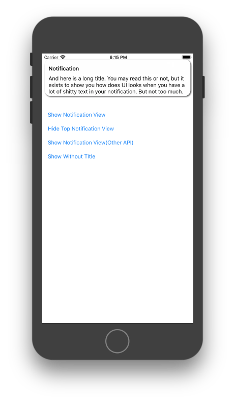

# iOS-11-Push-Notifications-InApp-View
Simple view that has super simple API and behaves similar to iOS 11 notifications, so you can use it inside the app.

How does it look ?

To show a notification view use class method `[NVNotificationView showNotificationWithTitle:andMessage:]`, it will show the notification view in your root `ViewController`. Also, you may use `[NVNotificationView showNotificationWithTitle:andMessage:inViewController:]` to show it in the concrete `ViewController`. Both these methods return a new instance of `NVNotificationView`.

View is automatically closed in the 3 seconds or you can dismiss it with swipe it up. Also, you can dismiss it programatically using `hide:(BOOL)animated` method.
